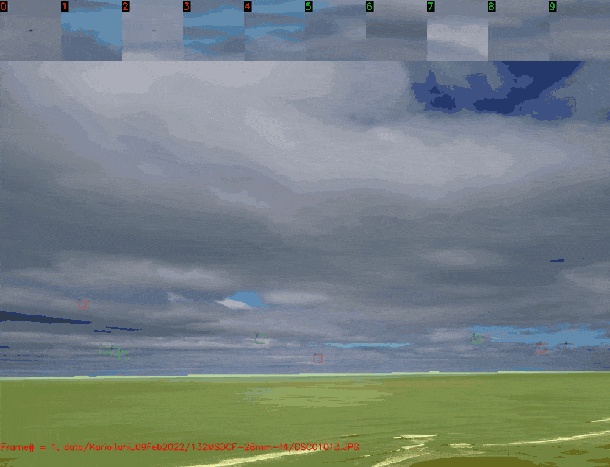
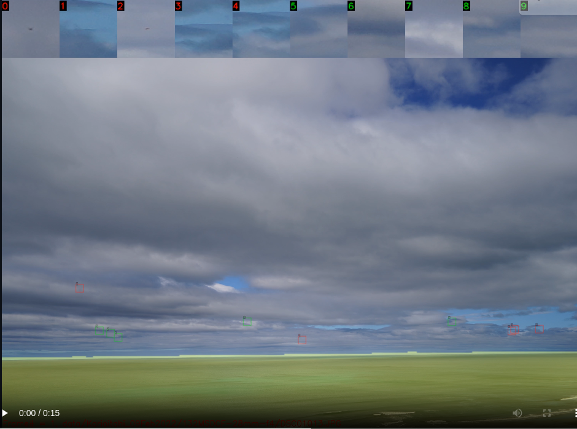

# Small Object Detector
Tracking of small objects in video frames

<p align="center">
  
</p>

### Installation

Download SmallObjDetector from github and create a virtual environment

- Tested on python 3.8

``` sh
mkdir repos
cd repos
git clone https://github.com/johnnewto/SmallObjDetector.git
cd small-object-detector
python -m venv 'venv'
source ./venv/bin/activate
pip install --upgrade pip
pip install -e .
```

if developing you can install dev packages 
``` sh
pip install -e .[dev]
```
Bump version using 
``` sh 
(venv) $ bumpver update --patch
INFO    - fetching tags from remote (to turn off use: -n / --no-fetch)
INFO    - Old Version: 0.0.1
INFO    - New Version: 0.0.2
INFO    - git commit --message 'bump version 0.0.1 -> 0.0.2'
INFO    - git tag --annotate 0.0.2 --message '0.0.2'
```

#### Install libturbojpeg

```bash
sudo apt-get install libturbojpeg
```

#### To install in another  a local package as editable 
``` sh
cd your-other-git-repo
pip install git+file:///home/$USER/repos/small-object-detector
```
 
### Usage

``` sh
sodrun -h
 Tracking of small objects in video frames
   keys: q     : quit
         space : pause
         g     : go
         d     : change direction
         d     : increment 10 frames
         a     : decrement 10 frames
         s     : increment 100 frames
         w     : decrement 100 frames
     
usage: sodrun [-h] [-r] [-d DIR]

optional arguments:
  -h, --help         show this help message and exit
  -r, --record       Enable recording
  -d DIR, --dir DIR  directory to view
```

IF no directory is given it runs small object detections on a small image [data set](https://github.com/johnnewto/MauiTracker/tree/main/data/Karioitahi_09Feb2022/132MSDCF-28mm-f4)

With one of the windows in focus press spacebar to step, g to go continuously, d to change direction and q to quit

<video width="1280" height="720"  controls>
  <source src="https://raw.githack.com/johnnewto/MauiTracker/main/data/Karioitahi_09Feb2022/132MSDCF-28mm-f4.mp4" type="video/mp4">
  This might show in github
</video>


[](https://raw.githack.com/johnnewto/MauiTracker/main/video.html)

Note: using  https://raw.githack.com/ to serve both mp4 and html


#### References
1. [Computer-Vision Based Collision Avoidance for UAVs](https://eprints.qut.edu.au/4627/1/4627.pdf)

2. [A Study of Morphological Pre-Processing Approaches for Track-Before-Detect Dim Target Detection](https://eprints.qut.edu.au/214476/1/16823.pdf)

3. [OpenCV Morphological Operations](https://pyimagesearch.com/2021/04/28/opencv-morphological-operations)

